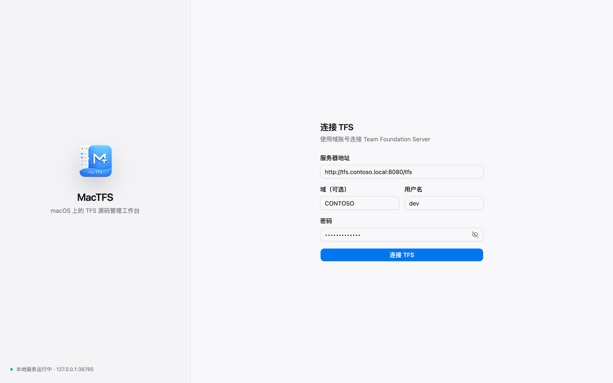
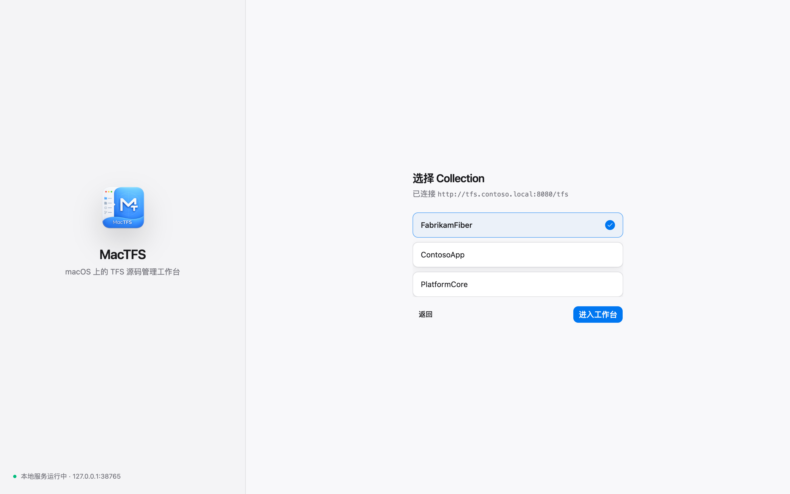
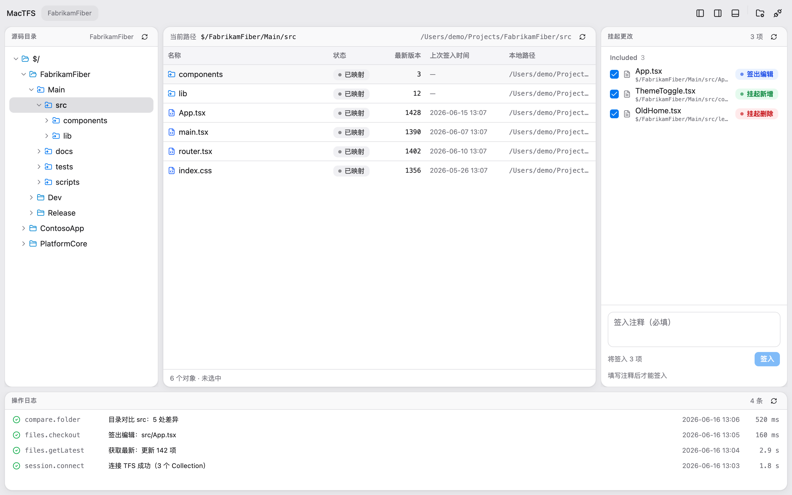
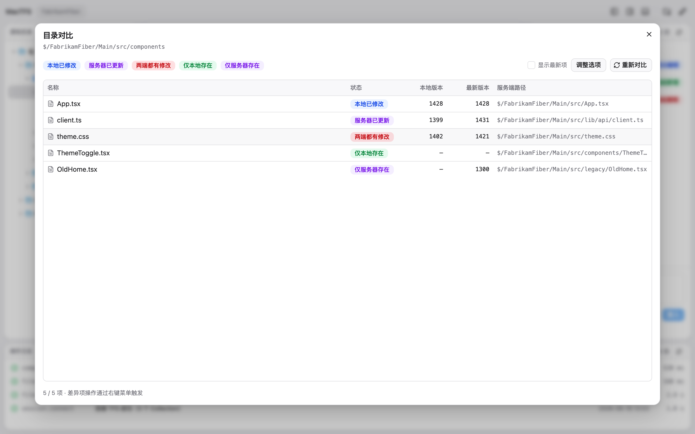
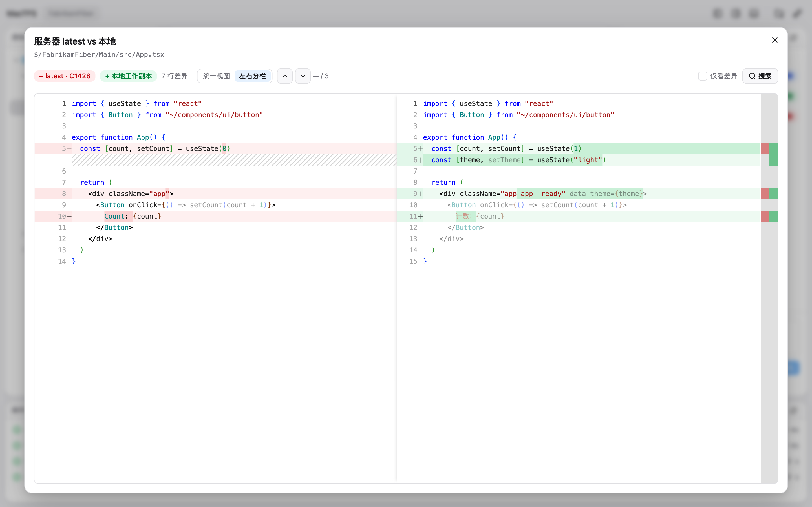

# macTFS

> 🤖 **本项目由 Claude（Anthropic AI）生成**：从产品需求、前后端代码，到这份 README 和界面截图，均为纯 AI 生成的实验性作品。
>
> 🤖 _Built entirely by Claude (Anthropic's AI). Requirements, code, this README, and screenshots are all AI-generated._

> macOS 上的 TFS（Azure DevOps Server）版本控制客户端 —— 脱离 IDE 宿主，独立运行的桌面应用 + 本地 HTTP API。

macTFS 让你在 **macOS（含 Apple Silicon）** 上直接对 **TFS / TFVC** 仓库做日常版本控制：获取最新、签出、签入、查看历史、目录与文件对比……不再依赖 Windows + Visual Studio，也不用为了一个 TFS 插件背着一整个 IntelliJ。

它由一个 **Electron 桌面前端** 和一个 **常驻本地 Java 服务** 组成。Java 服务复用微软官方的 TFS Java SDK 与 TFS 通信，并把能力封装成 `127.0.0.1` 上的 REST API —— 所以除了图形界面，你也可以用 `curl` / 脚本 / CI 直接调用。

---

## 截图

> 以下为演示数据，非真实服务器内容。

### 连接 TFS

| 填写连接信息 | 选择 Collection |
| :---: | :---: |
|  |  |

### 工作台

三栏布局：左侧服务端目录树、中间文件列表、右侧挂起更改与签入、底部操作日志。



### 对比与 Diff

| 目录对比 | 文件 Diff（Monaco） |
| :---: | :---: |
|  |  |

---

## 为什么做它

- **macOS 上几乎没有顺手的 TFVC 客户端。** 微软官方的 Team Explorer Everywhere 只剩命令行 / 老 Eclipse 插件且基本停更；IntelliJ 的 TFS 插件又必须绑着 IDE。
- **想要一个能独立运行、界面现代、对 Apple Silicon 友好的桌面工具。** 这就是 macTFS 的目标——为自己/小团队打造的「天天能用」的工具。
- **顺带提供 HTTP API。** 让 TFS 操作能被脚本和 CI 复用，而不只是点界面。

---

## 核心功能

- **连接与认证**：配置 TFS 服务器地址、NTLM 账号密码，测试连接、保持会话。
- **Collection / Workspace / Mapping**：选择项目集合，自动确保默认工作区，集中管理服务端路径 ↔ 本地路径映射。
- **服务端目录浏览**：左侧目录树 + 中间文件列表，同步导航、右键菜单统一动作。
- **文件同步**：Get Latest、获取指定版本 / Changeset。
- **签出签入闭环**：Checkout / Checkin / Add / Delete / Undo，签入附注释。
- **本地变更管理**：扫描并展示 Pending Changes，分组签入。
- **历史与对比**：文件 / 路径历史、Changeset 详情、本地 vs 云端 Diff、版本间对比、目录对比。
- **macOS 原生观感**：仿 Finder 的工作台、Sheet 风格弹窗与轻量动效。
- **操作日志**：底部可折叠控制台实时展示操作与错误。

> 完整的需求与 API 清单见 [`docs/mactfs-prd.md`](docs/mactfs-prd.md)。

---

## 技术架构

```
┌──────────────────────────────────────────────────────────┐
│  消费端：Electron UI  │  curl  │  脚本  │  CI Pipeline     │
└──────────────────────────┬───────────────────────────────┘
                           │ HTTP REST (localhost:38765)
                           ▼
┌──────────────────────────────────────────────────────────┐
│           mactfs-server（Java 8 + SparkJava）             │
│   HTTP 路由 · 会话管理 · 配置存储 · TFS 核心服务层         │
└──────────────────────────┬───────────────────────────────┘
                           ▼
┌──────────────────────────────────────────────────────────┐
│        Microsoft TFS SDK（tfsIntegration/lib）            │
│              SOAP 通信 · NTLM 认证 · 版本控制              │
└──────────────────────────────────────────────────────────┘
```

| 层级 | 技术 |
| --- | --- |
| 前端 | Electron + React 19 + React Router 7 + shadcn/ui + Tailwind CSS 4 + Monaco |
| 后端 | Java 8 + SparkJava（内嵌 HTTP 服务） |
| TFS 内核 | Microsoft TFS Java SDK（SOAP / NTLM） |
| 运行环境 | Zulu JDK 8 **x86_64** + Rosetta 2（见下方说明） |

> ⚠️ **为什么固定 x64 JDK：** TFS SDK 的 JNI 原生库只含 i386/x86_64，没有 arm64 切片。因此服务端 JVM 固定走 x64，在 Apple Silicon 上经 Rosetta 2 运行；Electron 界面本身仍是原生。

---

## 环境要求

- macOS 12+（Intel 或 Apple Silicon；Apple Silicon 需安装 Rosetta 2）
- [pnpm](https://pnpm.io/)（前端包管理）
- 首次构建需联网（自动下载 x64 JDK，见下）
- 目标 TFS：TFS 2015 及以下（TFVC）

---

## 快速开始

### 1. 克隆

```bash
git clone <你的仓库地址> mactfs
cd mactfs/mactfsui
pnpm install
```

### 2. 准备 x64 JDK（自动）

服务端需要一个 x64 的 JDK 8。仓库**不**收录这个 200M+ 的二进制，而是按需从 Azul 官方下载并校验：

```bash
cd mactfsui
pnpm prepare:runtime
```

脚本会检测本地是否已有 `zulu8.94.0.17-ca-jdk8.0.492-macosx_x64/`，没有就从 Azul 下载 → 校验 sha256 → 解压到仓库根目录。`pnpm dist` 会自动先跑这一步。

### 3. 构建后端

```bash
cd mactfs
../tfsIntegration/gradlew installDist
```

> 后端从 `mactfs/build/install/mactfs/lib/` 加载运行，改了 Java 代码必须重新 `installDist`。

### 4. 开发模式运行（推荐）

```bash
cd mactfsui
pnpm electron:dev
```

会同时拉起 vite 开发服务器和 Electron 窗口；Electron 发现后端没运行时会自动拉起它，退出时自动回收。

### 5. 打包成桌面应用（.app / .dmg）

```bash
cd mactfsui
pnpm dist
```

产物输出到 `mactfsui/dist-app/`（universal DMG，内置精简后的 x64 JRE 与服务端 jar）。

> 启动 / 停止 / 重启 / 排错的完整说明见 [`服务启停指南.md`](服务启停指南.md)。

---

## 使用流程

1. **连接**：填入 TFS 服务器地址、认证方式（NTLM）、账号 / 域 / 密码，点测试连接。
2. **选择 Collection**：登录成功后选择要操作的项目集合，系统自动确保默认 Workspace。
3. **建立映射**：在目录树或文件列表上「映射到本地」，把服务端路径绑到本地目录（可选立即 Get Latest）。
4. **同步文件**：对映射执行 Get Latest，或获取指定版本。
5. **改 → 签出 → 签入**：编辑文件后在右侧 Changes 面板查看 Pending Changes，填注释签入。
6. **历史 / 对比**：右键查看历史、Changeset 详情，或做本地 vs 云端、版本间、目录级的 Diff。

### 也可以直接调 API

服务监听 `127.0.0.1:38765`，token 存在 `~/.mactfs/server-token`：

```bash
TOKEN=$(cat ~/.mactfs/server-token)
curl -s -H "Authorization: Bearer $TOKEN" http://127.0.0.1:38765/api/health
```

完整 API 清单见 [`docs/mactfs-prd.md`](docs/mactfs-prd.md) 第四章。

---

## 目录结构

```
mydev/
├── mactfs/            # Java 后端：CLI + 本地 HTTP API 服务
├── mactfsui/          # Electron + React 桌面前端
│   ├── app/           # 前端源码（页面、组件、API client）
│   ├── electron/      # Electron 主进程 / preload
│   └── scripts/       # 打包辅助脚本（prepare-runtime.mjs 等）
├── tfsIntegration/    # 微软 TFS Java SDK 及原生库（构建依赖）
├── docs/              # PRD、需求、截图等文档
├── task/              # 分阶段开发任务单
└── testing/           # 端到端 / 接口测试报告
```

---

## 第三方依赖与许可

- 本项目通过 `tfsIntegration/` 下的 **Microsoft TFS Java SDK** 与 TFS 通信，其分发受微软相应许可约束。
- x64 JDK 由 [Azul Zulu](https://www.azul.com/downloads/) 提供，按需下载，不随仓库分发。

> macTFS 是面向个人 / 小团队的工具型项目，主要解决「在 Mac 上用老 TFS」这一具体痛点。
